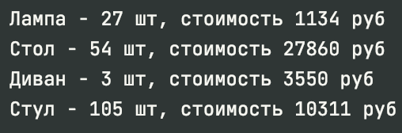

# Python. Лабораторная работа №1

<h3>Задание: Выполнение 11 заданий</h3>
<h3>Проделанная работа:</h3>
<b>00_distance.py</b> - Вывод расстояние между городами.<br>
<b>01_circle.py</b> - Вычисление значения площади круга и указания оежит ли точна внутри него или нет.<br>
<b>02_operations.py</b> - Указание знаков операций для конечного результата "25" ------<br>
<b>03_favorite_movies.py</b> - Вывод проиндексированный фильмов<br>
<b>04_my_family.py</b> - Вычисление роста отца и общего роста семьи<br>
<b>05_zoo.py</b> - Перемещение животных по спискам и определения индекса<br>
<b>06_songs_list.py</b> - Вычисление общего времени звучания песен<br>
<b>07_secret.py</b> - Расшифровка сообщения<br>
<b>08_garden.py</b> - Сортировка массива с цветами<br>
<b>09_shopping.py</b> - Сравнение цен в магазинах<br>
<b>10_store.py</b> - Расчёт сумму каждого товара на складе<br>

<h3>Шпаргалку по работе с командами:</h3>
```git add <file>``` <br>
```git commit <name commit>``` <br>
```git push``` <br>
<h3>Скриншоты результатов:</h3>
<b>00_distance.py</b><br>
<br><br>
<b>01_circle.py</b><br>
<br><br>
<b>02_operations.py</b><br>
<br><br>
<b>03_favorite_movies.py</b><br>
<br><br>
<b>04_my_family.py</b><br>
<br><br>
<b>05_zoo.py</b><br>
<br><br>
<b>06_songs_list.py</b><br>
<br><br>
<b>07_secret.py</b><br>
<br><br>
<b>08_garden.py</b><br>
<br><br>
<b>09_shopping.py</b><br>
<br><br>
<b>10_store.py</b><br>
<br><br>

<h3>Ссылки на используемые материалы: https://www.python.org/doc/ </h3>
